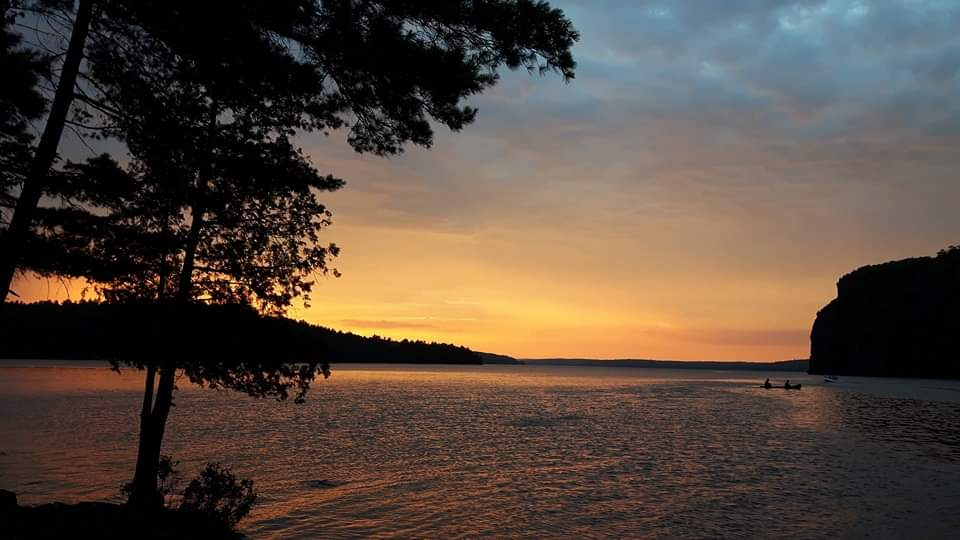

I am currently an NSERC Postdoctoral Fellow at The University of Toronto, working primarily with
[Stephen Wright](https://wright.eeb.utoronto.ca/). I did my
PhD in Evolutionary Biology with a minor in Bioinformatics,
working in [Matthew Hahn's lab](https://hahnlab.sitehost.iu.edu/) at Indiana
University Bloomington. I am broadly interested in theoretical and computational
approaches to phylogenomics. 

I was born and raised in Renfrew, Ontario, Canada. I went to the University of 
Toronto for my undergraduate, where I graduated with an Honours Bachelor of Science in 2017. 
In the past I've been involved in outdoor education, with jobs as a camp counselor and
as a Natural Heritage Educator at Bon Echo Provincial Park (see photo, taken at Mazinaw Lake, ON
in 2016). 
 
