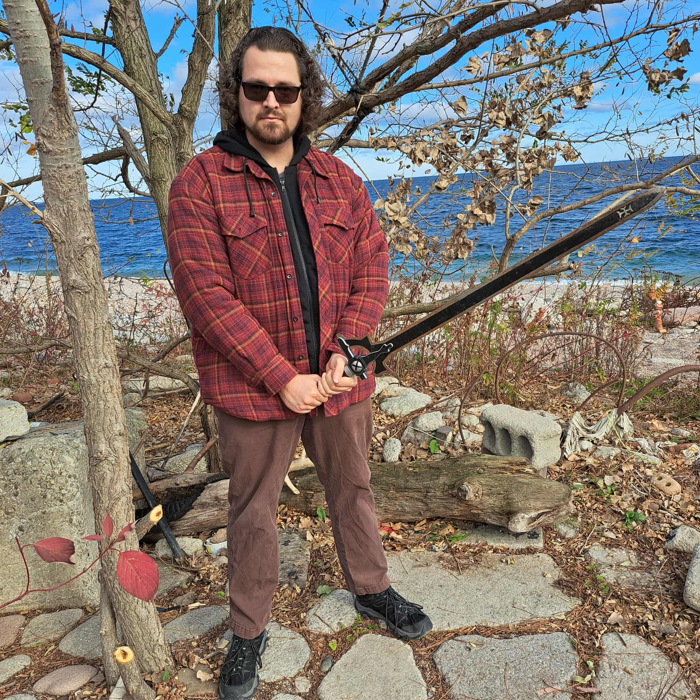
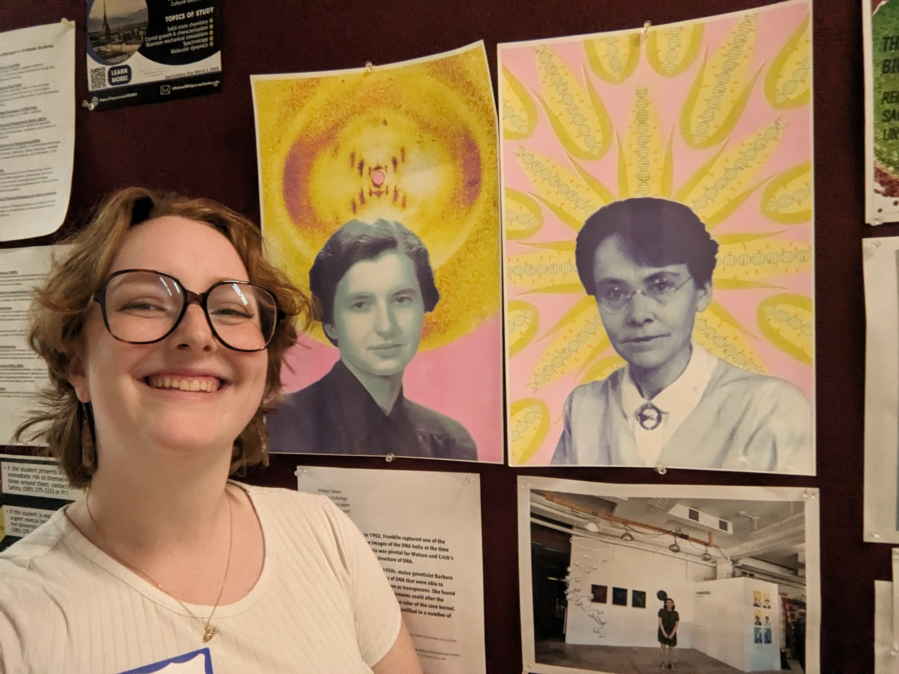

### Mark Hibbins 
Principal Investigator

Mark did his PhD in Evolutionary Biology with a minor in Bioinformatics, working with [Matthew Hahn](https://hahnlab.sitehost.iu.edu/) 
at Indiana University Bloomington. He was then an EEB Postdoctoral Fellow and NSERC Postdoctoral Fellow in the [Wright Lab](https://wright.eeb.utoronto.ca/)
at the University of Toronto before coming to U of R. Mark is broadly interested in theoretical and computational approaches to phylogenomics. He was born
and raised in Ontario, Canada, and enjoys good food, video games, and the great outdoors. 

Email: mark.hibbins@rochester.edu  
BlueSky: @rejectresubmit.bsky.social 
GitHub: github.com/mhibbins 
[CV](../CV.pdf)

### Olivia Frary
Rotation PhD Student

Olivia grew up in Utah and studied Bioinformatics at Utah Valley University, where she got involved in research on genome size evolution and 
the sex gap in longevity. After doing an REU at the University of Iowa, she realized she wanted to keep doing research long-term, 
which brought her to the University of Rochester for grad school. Here, she is interested in sex chromosome evolution and phylogenomic research. 
Outside of the lab, Olivia enjoys painting, yoga, and cross-stitch.

Email: ofrary@ur.rochester.edu 
Website: olivia-frary.github.io
 
### You? 

My lab is recruiting talented students and postdocs. Please 
reach out if you're interested!
