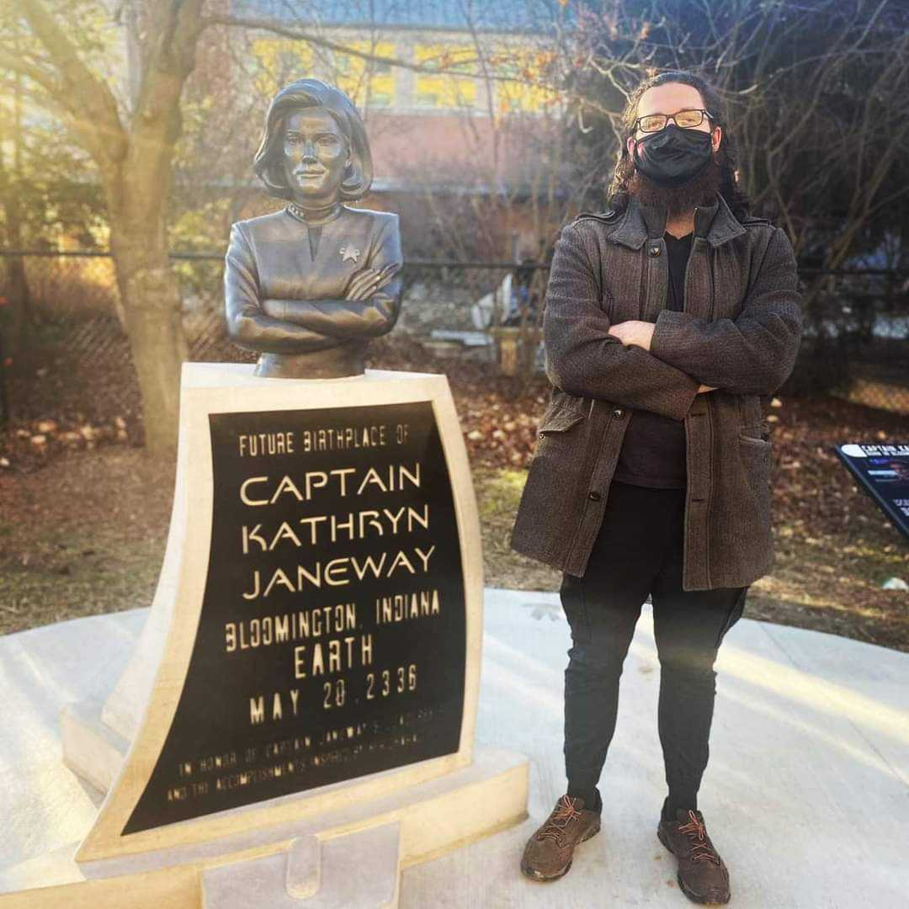

### Mark Hibbins 
Principal Investigator

My group at the University of Rochester will be starting in July 2025!
I am currently finishing up an NSERC Postdoctoral Fellowship at 
The University of Toronto, with [Stephen Wright](https://wright.eeb.utoronto.ca/). Previously, I did my
PhD in Evolutionary Biology with a minor in Bioinformatics, working with [Matthew Hahn](https://hahnlab.sitehost.iu.edu/) 
at Indiana University Bloomington. I am broadly interested in theoretical and computational
approaches to phylogenomics. I was born and raised in Ontario, Canada, and enjoy good food,
video games, and the great outdoors.

Email: mark.hibbins@utoronto.ca  
Twitter: @reject_resubmit 
GitHub: github.com/mhibbins 
[CV](../CV.pdf)
 
### You? 

My lab is recruiting talented students and postdocs to join in Fall 2025 or later. Please 
reach out if you're interested!
