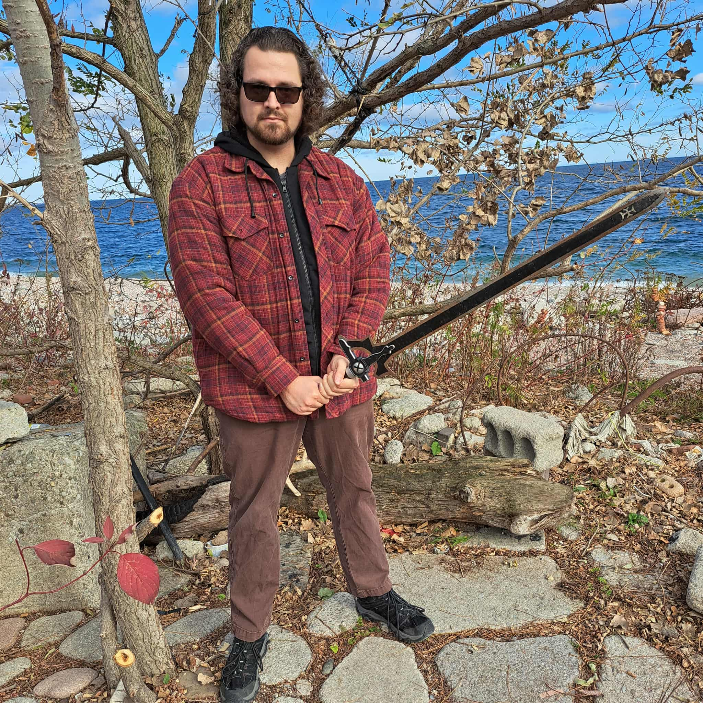
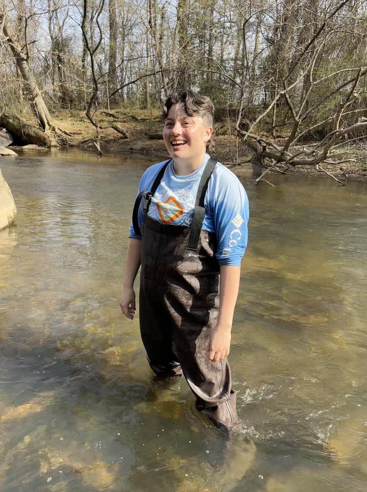
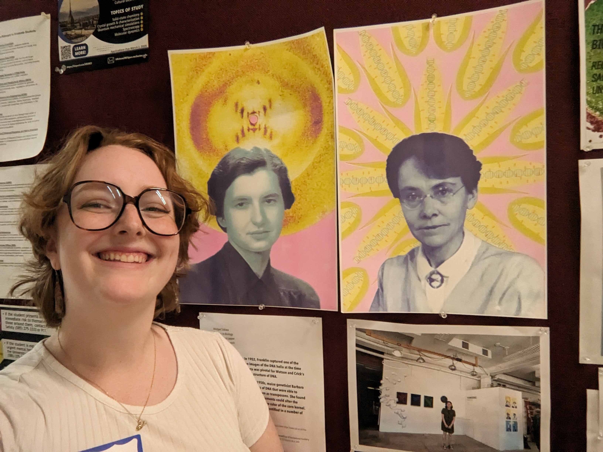
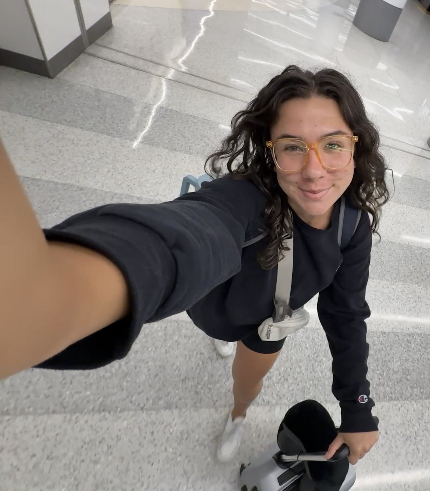

### Mark Hibbins 
Principal Investigator

Mark did his PhD in Evolutionary Biology with a minor in Bioinformatics, working with [Matthew Hahn](https://hahnlab.sitehost.iu.edu/) 
at Indiana University Bloomington. He was then an EEB Postdoctoral Fellow and NSERC Postdoctoral Fellow in the [Wright Lab](https://wright.eeb.utoronto.ca/)
at the University of Toronto before coming to U of R. Mark is broadly interested in theoretical and computational approaches to phylogenomics. He was born
and raised in Ontario, Canada, and enjoys good food, video games, and the great outdoors. 

Email: mark.hibbins@rochester.edu  
BlueSky: @rejectresubmit.bsky.social 
GitHub: github.com/mhibbins 
[CV](../CV.pdf)

### Elena M. Meyer
Postdoctoral Research Associate

Elena earned their PhD in Integrative Life Science in the [Eckert Lab](https://www.eckertlab.com/) at Virginia Commonwealth University. Prior to starting graduate school, they first became interested in evolutionary biology while an undergraduate at New College of Florida. They are interested in plant reproductive biology, phylogenetic comparative methods, and macroevolutionary patterns in angiosperm evolution. Elena also enjoys botanizing in the field, and is especially interested in the native flora of their home state, Virginia. Outside of work, they like cooking for their friends, learning languages, and creative writing.

Website: evoelena.com

### Olivia Frary
E2G2 PhD Student  
NSF Graduate Research Fellow

Olivia grew up in Utah and studied Bioinformatics at Utah Valley University, where she got involved in research on genome size evolution and 
the sex gap in longevity. After doing an REU at the University of Iowa, she realized she wanted to keep doing research long-term, 
which brought her to the University of Rochester for grad school. Here, she is interested in sex chromosome evolution and phylogenomic research. 
Outside of the lab, Olivia enjoys painting, yoga, and cross-stitch.

Email: ofrary@ur.rochester.edu 
Website: olivia-frary.github.io

### Abigail Waryanka
Data Science MS Student - Genomics Track  
GIDS-REM Fellow

Abby grew up in Pittsburgh, Pennsylvania and studied Biology and Computer Science at Allegheny College. Her undergraduate research focused on identifying differentially expressed genes and enriched pathways in cancer tissue, which helped spark her interest in genomics. She is now pursuing a Master’s in Data Science on the Genomics Track at the University of Rochester. She is continuing to study cancer genomics with interest in gene expression and cancer phylogenetics. In her free time, Abby enjoys playing soccer, traveling, and spending time at the beach.

Email: awaryank@ur.rochester.edu
 
### You? 

My lab is recruiting talented students and postdocs. Please 
reach out if you're interested!
