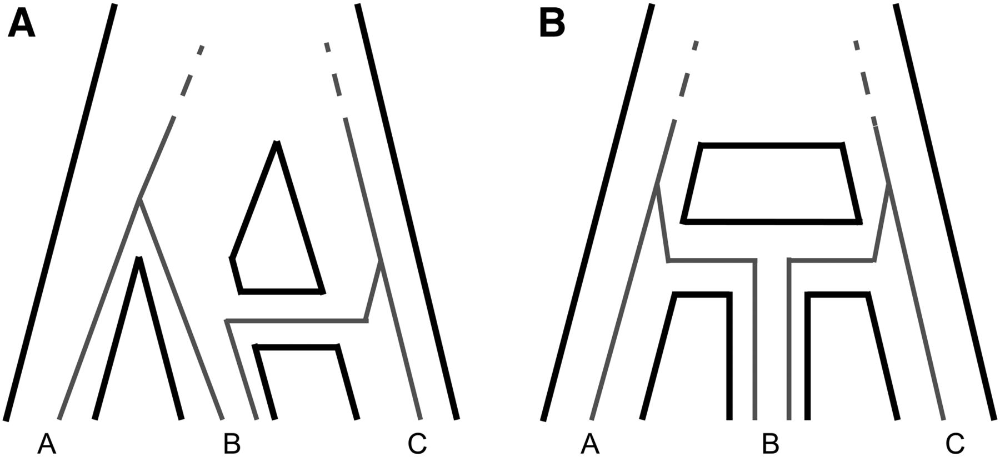

### Detecting and characterizing introgression from genomic data
&nbsp;  

Genomic data has revealed that **introgression**, the hybridization and subsequent
back-crossing of closely related species or isolated lineages, is common
across the tree of life. I have been working on ways to take advantage of this
abundance of data to make more detailed and biologically informed inferences about 
the occurrence, direction, timing, and biological factors affecting introgression.

### Accounting for gene tree discordance in phylogenetic comparative methods 
&nbsp;

Gene tree discordance is a widespread phenomenon where the topology of trees 
inferred at individual loci disagree both with each other and the species tree 
topology. Two major causes are incomplete lineage sorting and introgression.
Evolutionary changes along discordant gene tree branches results 
in potentially misleading patterns of trait evolution. Classic phylogenetic 
comparative methods do not account for these processes when making inferences 
about trait evolution. I have been developing theory and software
with the goal of making more robust inferences in the presence of gene tree
discordance. 

### Understanding the nature of genomic parallelism and convergence

A fundamental question in molecular evolution is whether convergence at the 
phenotypic level is underlain by convergence at the genetic / molecular 
level. I am using modern genomic techniques to answer this question in a 
variety of systems, focusing on two main topics: 1) the evolution of 
transcriptional regulation in response to convergent phenotypic evolution;
2) the evolution of mating system and sex chromosome variation among lineages.

