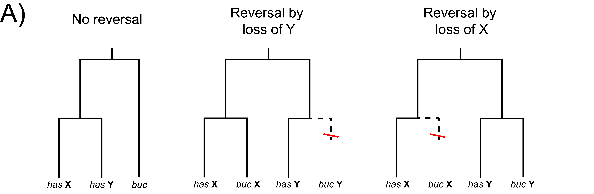
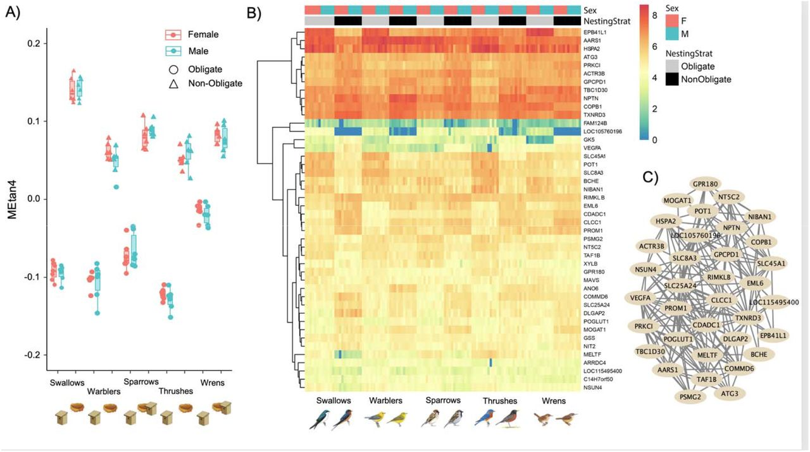

My research applies primarily theoretical and computational approaches to understand
the role that genomes play in macroevolutionary patterns and processes.  

### Detecting and characterizing introgression using genomic data
&nbsp;  

Modern genomic datasets across the tree of life have revealed a preponderance of 
hybridization and back-crossing among previously isolated lineages, a phenomenon 
called introgression. The high frequency of introgression is driving researchers 
to rethink the nature of species boundaries and our models of evolutionary relationships. 
Central to this endeavor is the creation of methods that can accurately detect and 
characterize introgression events. In my work, I develop mathematical models and 
statistical tools to make more detailed and biologically informed inferences about 
the occurrence, direction, timing, and biological factors affecting introgression.

### Accounting for gene tree discordance in phylogenetic comparative methods 
&nbsp;

The statistical toolkit of phylogenetic comparative methods is essential to our
understanding of processes of phenotypic evolution that play out over long timescales. 
These methods typically assume that a single, fixed species phylogeny can
describe evolutionary relationships, an assumption that is increasingly 
being challenged by high rates of non-treelike patterns of relatedness such
as incomplete lineage sorting and introgression. This can result in misleading
comparative inferences if such patterns are not corrected for. I am interested
in developing theory and software with the goal of making more robust comparative
inferences from sets of discordant gene trees, which more accurately reflect these
non-treelike processes.

### Understanding macroevolutionary drivers of genome and karyotype evolution
&nbsp;

The structure and content of genomes varies widely among species. 
The forces shaping this variation are complex and, in many cases, 
not well understood. I am investigating these questions using a combination 
of theory, methods development, and modern genomic techniques in a variety of 
systems. A major focus of this work to date has been investigating the drivers
of sex chromosome gain, loss, and turnover, the rate of which varies widely
across the eukaryotic tree of life. I am also interested in developing new
approaches to studying chromosomal rearrangements and the role they may
play in macroevolutionary processes such as genome evolution and speciation.

### The molecular basis of phenotypic convergence in complex quantitative traits

Advances in sequencing technology and computational resources are enabling the 
integration of phylogenetic comparative methodds with large-scale "omics" 
datasets. This is opening new avenues for investigations of the molecular
genetic basis of convergent evolution in complex quantitative traits with 
highly polygenic genetic underpinnings. I am particularly interested in the 
evolution of gene expression across the whole transcriptome in response to 
such instances of phenotypic convergence. This work has been conducted 
primarily in collaborative efforts, with a current focus on the evolution of 
cavity nesting and territorial aggression in songbirds.
